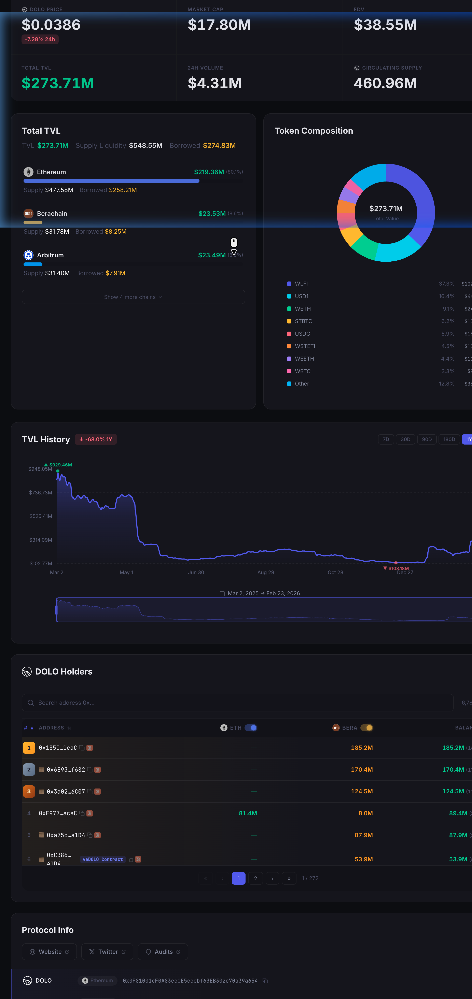

# 📊 veDOLO Dashboard

Real-time analytics dashboard for the [Dolomite](https://dolomite.io) protocol — tracking DOLO token, veDOLO governance, oDOLO options, and DeFi earnings across Berachain, Ethereum, Arbitrum, and more.

**🔗 [Live Dashboard](https://twojekrypto.github.io/vedolo-dashboard/)**



---

## ✨ Features

### 🪙 DOLO Tab
- Live DOLO price, market cap, FDV, 24h volume
- Total TVL breakdown by chain with interactive charts
- TVL History (7D / 30D / 90D / 180D / 1Y)
- Token composition donut chart
- Full DOLO holders ranking with contract/multisig/team labels
- DeBank & Etherscan/Berascan integration per holder

### 🏛️ veDOLO Tab
- Unique holders, active locks, DOLO locked, total vote weight
- Sortable/searchable holders table
- Detailed lock profiles with individual lock cards (amount, unlock date, vote weight)
- Early exit tracking with penalty data

### ⚡ oDOLO Tab
- Vester balance, exercised amount, revenue generated
- Average veDOLO price tracking
- Full exerciser history with per-address breakdowns
- Sticky headers and smooth scrolling modals

### 💰 Earn Tab
- Multi-chain yield tracking (Ethereum, Arbitrum, Berachain, Mantle, + more)
- Real-time balance fetching via on-chain RPC calls
- Historical yield comparison with snapshot calendar
- Smart period selection (3D / 7D / 14D / 21D / 28D)
- Optional local per-address verified ledger source (`data/earn-verified-ledger`) for higher-confidence totals
- Optional local per-address subaccount event history (`data/earn-subaccount-history`) for exact owner/account/market replay inputs

The verified ledger now carries both raw historical status and stricter canonical-history-aware fields:
- `status` / `method` remain the raw historical classification
- `strictStatus` / `strictMethod` are the fields to use for strict reruns and reporting
- canonical provenance is attached per market via `canonicalHistory*` fields

## Live Audit Config & Checks

Operational live-audit tuning now lives in:
- `config/earn_live_defaults.json`

Use it for things that change between environments or over time:
- localhost/debug endpoints
- default worker counts
- timeout-retry worker counts for chained live reruns
- browser polling / settle timing
- checkpoint flush cadence
- chained live rerun limits

Do **not** move audit classification logic into config. Categories, strict semantics,
and reconciliation rules stay in code so they remain reviewable and testable.

Local checks:

```bash
python3 run_earn_audit_checks.py
# or
npm run check:earn-audit
```

The check runner covers:
- `py_compile` for core Python entrypoints
- `node --check` for the generated `LIVE_AUDIT_JS`
- unit tests under `tests/`

CI:
- `.github/workflows/earn-audit-checks.yml` runs the same checks on push / pull request
  for the strict EARN audit tooling files

---

## 🧾 EARN Subaccount History (Canonical Event Source)

You can build a per-address, per-subaccount event ledger directly from Dolomite margin events.
This is the strict source-of-truth path for reconstructing owner/account/market history without guessing hidden collateral from snapshots.

```bash
# Example: build canonical subaccount history for selected addresses
python3 build_earn_subaccount_history.py \
  --chain arbitrum \
  --address 0xYourAddress1 \
  --address 0xYourAddress2
```

Outputs:
- `data/earn-subaccount-history/{chain}/{address}.json`
- `data/earn-subaccount-history/manifest.json`

Notes:
- current-layout events keep exact `account` + `newPar`
- legacy events that do not expose account numbers are preserved under `legacy-unknown`
- for fast smoke tests or partial backfills, use `--from-block` / `--to-block`

For large backfills (for example all Arbitrum addresses), use the resumable batch runner:

```bash
# Example: resumable Arbitrum backfill in batches of 250 addresses
python3 backfill_earn_subaccount_history.py \
  --chain arbitrum \
  --batch-size 250
```

Useful flags:
- `--stop-after-batches 1` for a smoke test
- `--start-index` / `--end-index` to split work deterministically
- `--no-resume` to ignore prior progress metadata
- `--no-skip-existing` to force a rebuild even if a file already covers the target block

To inspect current coverage, benchmark sample throughput, and generate shard-safe commands:

```bash
# 1. Show current canonical coverage status
python3 plan_earn_data_correctness.py status --chain arbitrum

# 2. Benchmark a small sample and save throughput metadata
python3 plan_earn_data_correctness.py benchmark --chain arbitrum --sample-size 5

# 3. Generate a worker/shard plan from the saved benchmark
python3 plan_earn_data_correctness.py plan --chain arbitrum --desired-hours 12
```

## 🔎 Strict Static EARN Reruns

Once `data/earn-verified-ledger` has been rebuilt on the stricter canonical-history-aware basis,
you can rerun the whole chain's static audit without recomputing every wallet from scratch:

```bash
# Rebuild the strict verified ledger first
python3 build_earn_verified_ledger.py --chain arbitrum --all-addresses

# Then rerun every active market on that chain
python3 rerun_earn_chain_static_audit.py --chain arbitrum --workers 4
```

Outputs:
- `data/earn-audit-reruns/{chain}/{run-id}/summary.json`
- `data/earn-audit-reruns/{chain}/{run-id}/reports/*.json`
- `data/earn-audit-reruns/{chain}/{run-id}/unresolved/*.json`

Notes:
- strict reruns consume `strictStatus` / `strictMethod`, not the raw historical status
- raw historical fields stay in the ledger for diagnostics and for explaining why a market was downgraded

For the faster production path, scan the chain once into block-range event shards and
then materialize per-address histories locally:

```bash
# 1. Generate a one-pass scan/materialize plan
python3 plan_earn_data_correctness.py one-pass-plan \
  --chain arbitrum \
  --max-scan-workers 12 \
  --max-materialize-workers 12

# 2. Run one or more block-range scanners (same selected address set, disjoint blocks)
python3 scan_earn_subaccount_history_events.py \
  --chain arbitrum \
  --all-known-addresses \
  --from-block 29750000 \
  --to-block 135000000 \
  --progress-key s1of4

# 3. Materialize canonical per-address histories from the local event shards
python3 materialize_earn_subaccount_history.py \
  --chain arbitrum \
  --all-known-addresses \
  --start-index 0 \
  --end-index 16000
```

Fast-path notes:
- `scan_earn_subaccount_history_events.py` scans each block range once and writes `data/earn-subaccount-history-events/{chain}/*.json`
- `materialize_earn_subaccount_history.py` rebuilds strict per-address histories from those local shards without extra RPC reads
- this is the preferred path once you need full-chain correctness work at scale, because it removes repeated full rescans for every address shard

Validation and consistency tools:

```bash
# Validate shard/progress completeness vs the saved one-pass plan
python3 validate_earn_subaccount_history_events.py \
  --chain arbitrum \
  --events-dir data/earn-subaccount-history-events

# Compare canonical per-address histories against existing earn-netflow totals
python3 check_earn_subaccount_history_consistency.py \
  --chain arbitrum \
  --limit 100

# Summarize strict provenance per wallet/market:
# fresh coverage at target block vs exact consistency at comparison block
python3 report_earn_subaccount_history_provenance.py \
  --chain arbitrum \
  --limit 100 \
  --include-markets
```

Use these before treating the canonical history as production-ready:
- `validate_earn_subaccount_history_events.py` catches missing ranges, overlaps, selection-hash drift, and incomplete worker progress
- `check_earn_subaccount_history_consistency.py` highlights where historical `earn-netflow` disagrees with the canonical event ledger at an exact comparison block
- `report_earn_subaccount_history_provenance.py` keeps coverage and consistency separate, so a wallet can be "fresh" without being silently treated as an exact match to netflow

For day-to-day operation, prefer the pipeline runner instead of ad-hoc shell snippets:

```bash
# Ensure the scan stage is running; once the scan is fully complete,
# the same command will start the materialize stage automatically, and once
# materialization is complete it will also plan/start the repair tail if needed.
python3 run_earn_data_correctness_pipeline.py continue --chain arbitrum

# Inspect current scan/materialize status
python3 run_earn_data_correctness_pipeline.py status --chain arbitrum

# Build a targeted repair plan for missing/stale histories
python3 run_earn_data_correctness_pipeline.py plan-repair --chain arbitrum --json

# Start repair-only materialization workers from the current coverage gap
python3 run_earn_data_correctness_pipeline.py start-repair --chain arbitrum
```

If the scan is complete but only part of the per-address histories is fresh,
generate a targeted repair materialization plan instead of rebuilding every wallet:

```bash
# Plan repair-only materialization for wallets that are still missing or stale
python3 plan_earn_subaccount_history_repairs.py \
  --chain arbitrum \
  --workers 8
```

This writes a repair plan plus newline-delimited address shards under:
- `data/earn-subaccount-history/.repair-plans/<plan-id>/repair-plan.json`
- `data/earn-subaccount-history/.repair-plans/<plan-id>/*.txt`

Each generated command uses `--address-file`, so the repair run only touches the
wallets that still need fresh canonical history.

Once the full baseline is complete, prefer the strict incremental cycle instead of
rescanning the whole chain again:

```bash
# 1. Plan the next strict delta cycle from the current canonical baseline
python3 plan_earn_subaccount_history_incremental.py \
  --chain arbitrum \
  --json

# 2. Run the generated delta scan commands (new blocks only, tracked addresses only)
#    They write into a dedicated cycle directory under:
#    data/earn-subaccount-history/.incremental-plans/<cycle-id>/events

# 3. If the planner reports new known addresses, run the generated
#    build_earn_subaccount_history.py --address-file ... commands for those wallets.

# 4. Apply the delta onto existing histories
#    This appends exact event deltas for touched wallets and metadata-stamps
#    untouched tracked wallets to the same target block.
python3 apply_earn_subaccount_history_delta.py \
  --chain arbitrum \
  --address-file data/earn-subaccount-history/.incremental-plans/<cycle-id>/addresses/tracked-addresses.txt \
  --events-dir data/earn-subaccount-history/.incremental-plans/<cycle-id>/events \
  --history-dir data/earn-subaccount-history \
  --output-dir data/earn-subaccount-history
```

Strict incremental notes:
- delta scans use a dedicated cycle directory, so they do not mutate the immutable baseline shard set
- newly-discovered wallets are backfilled directly from chain start to the new target block; they are not guessed from partial delta data
- untouched tracked wallets are still advanced to the new `targetBlock`, but only because the delta scan proved there were no matching events for them in that block range
- `build_earn_subaccount_history.py` and `scan_earn_subaccount_history_events.py` both support `--address-file`, so targeted subsets stay deterministic and shell-safe

For normal operations, prefer the dedicated incremental runner instead of
manually stepping through planner + scan + apply:

```bash
# Build or refresh the current incremental cycle plan
python3 run_earn_subaccount_history_incremental.py plan --chain arbitrum

# See the current cycle status
python3 run_earn_subaccount_history_incremental.py status --chain arbitrum

# Start or resume the cycle
python3 run_earn_subaccount_history_incremental.py continue --chain arbitrum
```

The runner keeps a pointer to the current cycle, launches only missing workers,
and advances through:
- delta scan
- new-address backfill
- delta apply

When a cycle is fully complete, the next `continue` call automatically plans the
next strict delta cycle from the latest canonical baseline.

## ✅ Verified EARN Ledger (Phase 1)

You can precompute deterministic, per-address EARN yield files locally and let the UI use them as the preferred source for `Total Yield`.
These files are intended to stay private and should not be committed to git.

```bash
# Example: build verified files for selected addresses
python3 build_earn_verified_ledger.py \
  --chain arbitrum \
  --chain ethereum \
  --address 0xYourAddress1 \
  --address 0xYourAddress2
```

Outputs:
- `data/earn-verified-ledger/{chain}/{address}.json`
- `data/earn-verified-ledger/manifest.json`

When a file exists for the queried wallet, EARN uses it before snapshot fallback logic.

## 🔎 EARN Asset Audit

For repeatable local audits of a specific EARN asset, use:

```bash
# 1. Build a fast static cohort from snapshots + netflow
python3 audit_earn_asset.py static \
  --chain arbitrum \
  --symbol USDC

# 2. Run a live replay audit against localhost + Chrome remote debugger
python3 audit_earn_asset.py live \
  --chain arbitrum \
  --symbol USDC \
  --localhost-url 'http://127.0.0.1:8902/index.html?cb=usdc_audit' \
  --debug-json-url 'http://127.0.0.1:9555/json'

# 2b. Or use a named preset for safer scaling without hand-writing endpoints
python3 audit_earn_asset.py live \
  --chain arbitrum \
  --symbol USDC \
  --live-preset dual-sharded

# 3. Summarize an existing live audit result
python3 audit_earn_asset.py summarize-live \
  --results /tmp/earn_audit_arbitrum_usdc_live.json

# 4. Merge a full pass with retry passes (latest row wins per wallet)
python3 audit_earn_asset.py merge-live \
  --results /tmp/usdc_full.json /tmp/usdc_timeout_retry.json /tmp/usdc_final_retry.json \
  --output /tmp/usdc_merged.json

# 5. Extract a focused retry cohort from an existing live result
python3 audit_earn_asset.py extract-live \
  --results /tmp/usdc_merged.json \
  --mode blocking \
  --chain arbitrum \
  --output /tmp/usdc_blocking_retry.json

# 6. Build a forensic report for the remaining real blockers
python3 audit_earn_asset.py forensic-live \
  --results /tmp/usdc_merged.json \
  --output /tmp/usdc_forensic.json
```

Notes:
- audit outputs default to `/tmp` and should stay local/private
- `static` is fast and good for cohort sizing plus unresolved filtering
- `live` is slower but checks the real replay/verification behavior of the UI
- `summarize-live` also groups root causes / patterns (for example timeout-heavy cases vs real snapshot mismatches)
- `merge-live` should be used after retries so the newest row for each wallet replaces older pass results
- `extract-live` is the easiest way to build timeout/blocking retry inputs without hand-editing JSON
- `forensic-live` turns the remaining real tail into a focused blocker report with root causes and current-state context

For repeated top-market reruns on the stricter canonical-history basis, use:

```bash
# 1. Build or refresh a pinned live plan from the latest full strict static rerun
python3 run_earn_chain_live_rerun.py plan \
  --chain arbitrum \
  --refresh-history

# 2. Show current pinned live rerun status
python3 run_earn_chain_live_rerun.py status \
  --chain arbitrum

# 3. Run or resume the pinned live rerun sequence
python3 run_earn_chain_live_rerun.py continue \
  --chain arbitrum \
  --refresh-history

# 3b. Use the 2x Chrome preset for faster pinned reruns
python3 run_earn_chain_live_rerun.py continue \
  --chain arbitrum \
  --refresh-history \
  --live-preset dual-sharded
```

`run_earn_chain_live_rerun.py` automatically:
- refreshes canonical subaccount history through the incremental runner
- resolves the newest canonical `targetBlock`
- selects top unresolved markets from the latest full strict static summary
- runs `audit_earn_asset.py live` with `--block-tag` pinned to that canonical block
- can use a slightly larger worker pool for the timeout-retry tail than for the full pass
- runs a timeout-only retry pass when the full pass leaves timeout rows
- merges latest rows, writes forensic output, and explains the true tail against canonical history
- writes a combined strict-static + live report under `data/earn-live-reruns/`
- refuses to start a new chained live market if another `audit_earn_asset.py live` process is already running

Useful presets:
- `single-fast`: one Chrome endpoint with the tuned `6/8` worker defaults
- `dual-sharded`: two Chrome debug endpoints (`9555` + `9666`) with a wider worker pool for faster reruns

---

## ⚙️ Data Pipeline

Data is auto-updated via **GitHub Actions** workflows:

| Workflow | Schedule | Description |
|----------|----------|-------------|
| `Update veDOLO Data` | Every hour | veDOLO holders, DOLO price, DeFi Llama TVL, oDOLO contract data |
| `Update DOLO Holders` | Every hour | Incremental DOLO token holder scanning (Ethereum + Berachain) |
| `Update oDOLO Data` | Daily (3:00 UTC) | Exercised USD totals, average lock durations, exerciser profiles |

---

## 🛠️ Tech Stack

- **Frontend**: Vanilla HTML/CSS/JS — single `index.html` with zero framework dependencies
- **Data Scripts**: Python 3.11 (`requests`, `web3`)
- **APIs**: Berascan, Etherscan, DeFi Llama, Dolomite RPC
- **Hosting**: GitHub Pages
- **CI/CD**: GitHub Actions with incremental caching

---

## 🚀 Local Development

```bash
# Clone the repo
git clone https://github.com/Twojekrypto/vedolo-dashboard.git
cd vedolo-dashboard

# Serve locally
python3 -m http.server 8080
# → Open http://localhost:8080
```

---

## 📁 Project Structure

```
├── index.html                  # Main dashboard (HTML + CSS + JS)
├── preview.png                 # Dashboard preview screenshot
├── *.svg                       # Logo assets (DOLO, veDOLO, oDOLO)
│
├── update_data.py              # veDOLO holders + price fetcher
├── generate_dolo_holders.py    # DOLO holder scanner (incremental)
├── generate_exercisers.py      # oDOLO exerciser profiler
├── fetch_defillama.py          # DeFi Llama TVL data
├── fetch_odolo_contract.py     # oDOLO contract state
├── fetch_early_exits.py        # Early exit penalty tracker
├── calculate_avg_lock.py       # Average lock duration calculator
├── update_exercised_usd.py     # Exercised USD aggregator
├── scan_earn_netflow.py        # Earn tab netflow scanner
│
├── *.json / *.csv              # Auto-generated data files
├── data/                       # Earn snapshots (historical)
└── .github/workflows/          # GitHub Actions automation
```

---

## 📜 License

This project is open source. Built with ❤️ for the Dolomite community.
